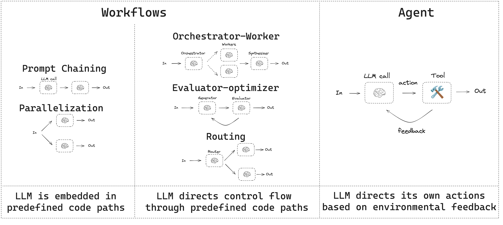

# LangGraphJS > tutorials > Workflows and Agents

This project is based on the [Workflows and Agents](https://langchain-ai.github.io/langgraphjs/tutorials/workflows/#agent)

This guide reviews common patterns for agentic systems. In describing these systems, it can be useful to make a distinction between "workflows" and "agents". One way to think about this difference is nicely explained here by Anthropic:

- **Workflows** are systems where LLMs and tools are orchestrated through predefined code paths.
- **Agents**, on the other hand, are systems where LLMs dynamically direct their own processes and tool usage, maintaining control over how they accomplish tasks.

