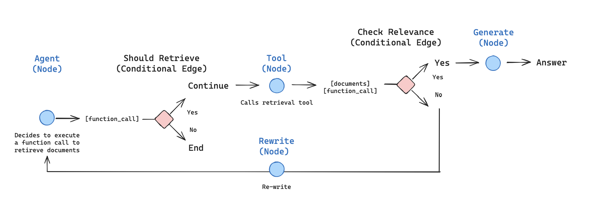
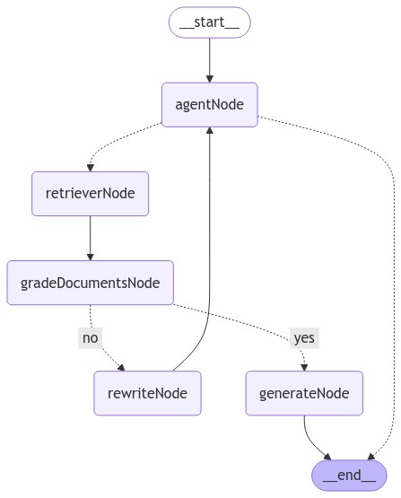

# LangGraphJS > tutorials > Customer support chatbot with a small model

This project is based on the [Customer support chatbot with a small model](https://langchain-ai.github.io/langgraphjs/tutorials/chatbots/customer_support_small_model/)

Below is an example of a customer support chatbot modeled as a state machine. It is designed to work with smaller models by giving them context as to what part of an interaction they are in, reducing the decision space a given LLM call has to keep them focused.

The entrypoint is a node containing a chain that we have prompted to answer basic questions, but delegate questions related to billing or technical support to other "teams".

Depending on this entry node's response, the edge from that node will use an LLM call to determine whether to respond directly to the user or invoke either the billing_support or technical_support nodes.

