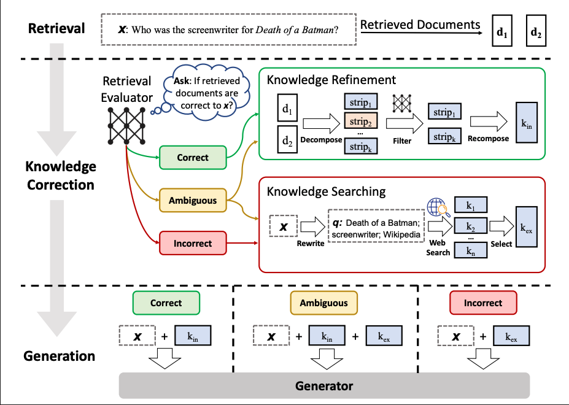
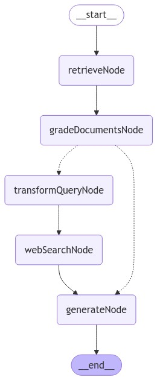

# LangGraphJS > tutorials > Customer support chatbot with a small model

This project is based on the [Customer support chatbot with a small model](https://langchain-ai.github.io/langgraphjs/tutorials/chatbots/customer_support_small_model/)

One of the most powerful applications enabled by LLMs is sophisticated question-answering (Q&A) chatbots. These are applications that can answer questions about specific source information. These applications use a technique known as Retrieval Augmented Generation, or RAG.

