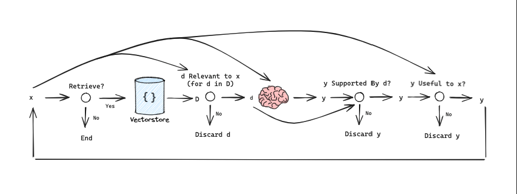
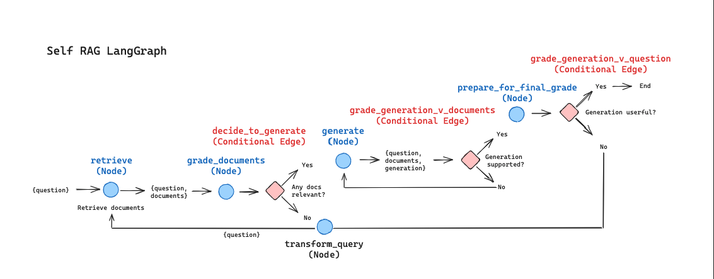
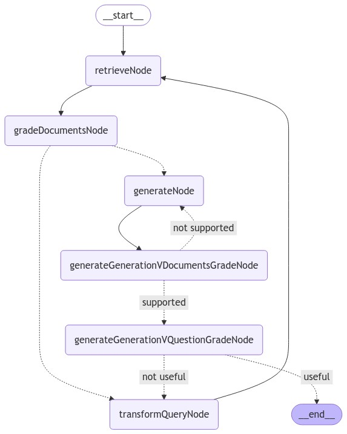

# LangGraphJS > tutorials > Self-RAG

This project is based on the [Self-RAG](https://langchain-ai.github.io/langgraphjs/tutorials/rag/langgraph_self_rag/)

Self-reflection can enhance RAG, enabling correction of poor quality retrieval or generations.

