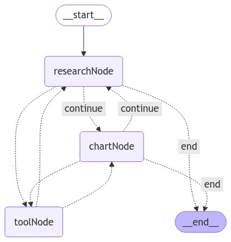

# LangGraphJS > tutorials > Basic Multi-agent Collaboration

This project is based on the [Basic Multi-agent Collaboration](https://langchain-ai.github.io/langgraphjs/tutorials/multi_agent/multi_agent_collaboration/)

This Project [inspired by the paper AutoGen: Enabling Next-Gen LLM Applications via Multi-Agent Conversation, by Wu, et. al.](https://arxiv.org/abs/2308.08155) shows one way to do this using LangGraph.
The resulting graph will look something like the following diagram:

