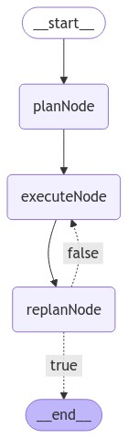

# LangGraphJS > tutorials > Plan-and-Execute

This project is based on the [Plan-and-Execute](https://langchain-ai.github.io/langgraphjs/tutorials/plan-and-execute/plan-and-execute/)

This notebook shows how to create a "plan-and-execute" style agent. This is heavily inspired by the Plan-and-Solve paper as well as the Baby-AGI project.

The core idea is to first come up with a multi-step plan, and then go through that plan one item at a time. After accomplishing a particular task, you can then revisit the plan and modify as appropriate.

This compares to a typical ReAct style agent where you think one step at a time. The advantages of this "plan-and-execute" style agent are:

- Explicit long term planning (which even really strong LLMs can struggle with)
- Ability to use smaller/weaker models for the execution step, only using larger/better models for the planning step

