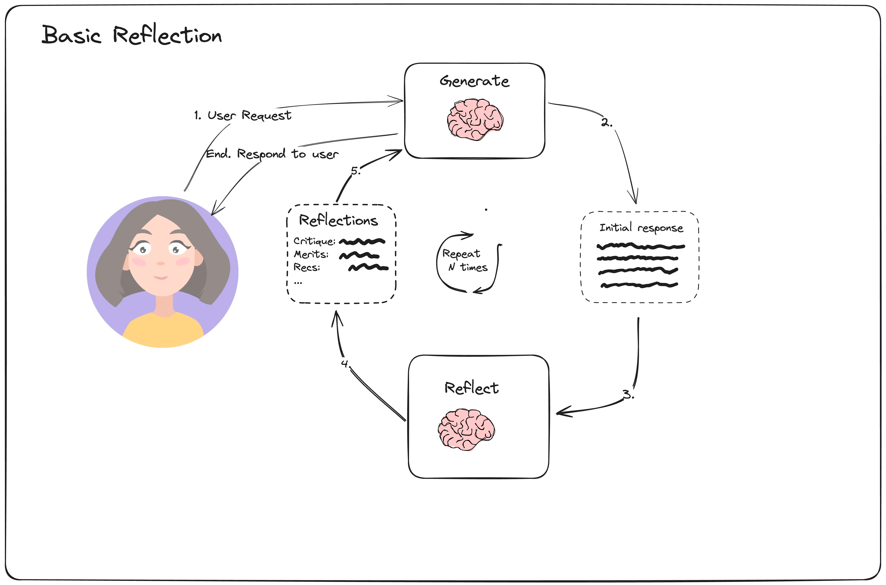
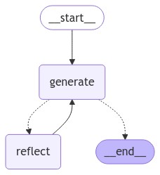

# LangGraphJS > tutorials > Reflection

This project is based on the [Reflection](https://langchain-ai.github.io/langgraphjs/tutorials/reflection/reflection/)

In the context of LLM agent building, reflection refers to the process of prompting an LLM to observe its past steps (along with potential observations from tools/the environment) to assess the quality of the chosen actions. This is then used downstream for things like re-planning, search, or evaluation.

