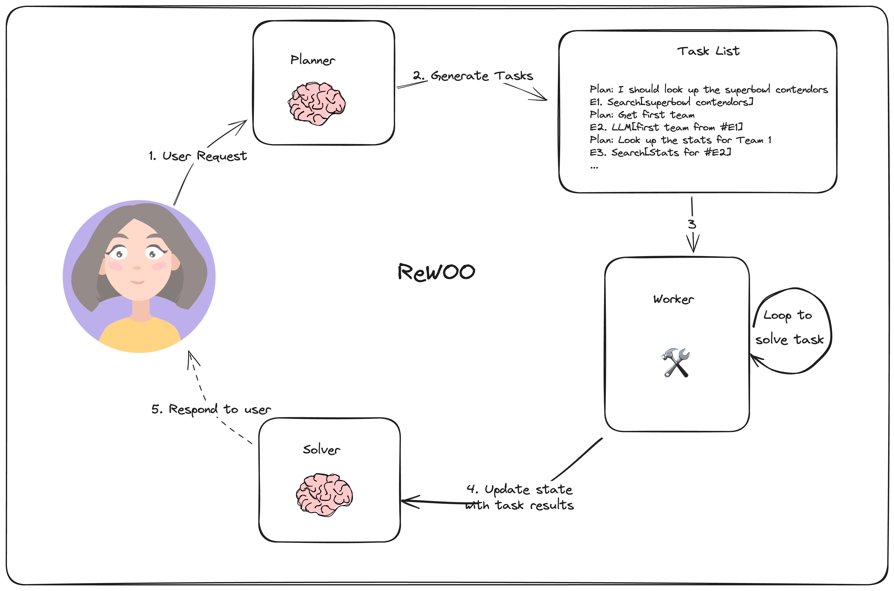

# LangGraphJS > tutorials > Reasoning without Observation

This project is based on the [Reasoning without Observation](https://langchain-ai.github.io/langgraphjs/tutorials/rewoo/rewoo/)

In [ReWOO](https://arxiv.org/abs/2305.18323), Xu, et. al, propose an agent that combines a multi-step planner and variable substitution for effective tool use. It was designed to improve on the ReACT-style agent architecture in the following ways:

Reduce token consumption and execution time by generating the full chain of tools used in a single pass. (ReACT-style agent architecture requires many LLM calls with redundant prefixes (since the system prompt and previous steps are provided to the LLM for each reasoning step)
Simplify the fine-tuning process. Since the planning data doesn't depend on the outputs of the tool, models can be fine-tuned without actually invoking the tools (in theory).
The following diagram outlines ReWOO's overall computation graph:

