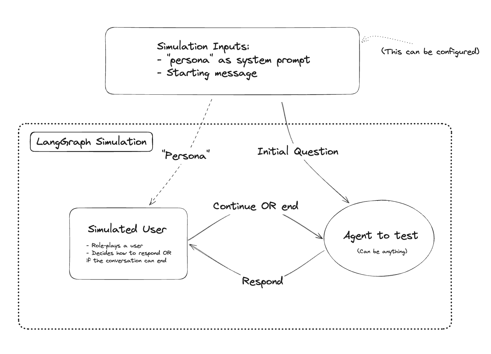
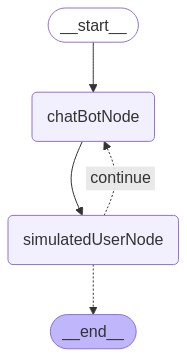

# LangGraphJS > tutorials > Chat Bot Evaluation as Multi-agent Simulation

This project is based on the [Chat Bot Evaluation as Multi-agent Simulation](https://langchain-ai.github.io/langgraphjs/tutorials/chatbot-simulation-evaluation/agent-simulation-evaluation/)

When building a chat bot, such as a customer support assistant, it can be hard to properly evaluate your bot's performance. It's time-consuming to have to manually interact with it intensively for each code change.

One way to make the evaluation process easier and more reproducible is to simulate a user interaction.

Below is an example of how to create a "virtual user" with LangGraph.js to simulate a conversation.

The overall simulation looks something like this:

