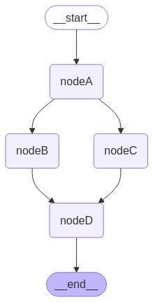

# LangGraphJS > tutorials > How to create branches for parallel node execution

This project is based on the [How to create branches for parallel node execution](https://langchain-ai.github.io/langgraphjs/how-tos/branching/)

LangGraph natively supports fan-out and fan-in using either regular edges or conditionalEdges.

This lets you run nodes in parallel to speed up your total graph execution.

