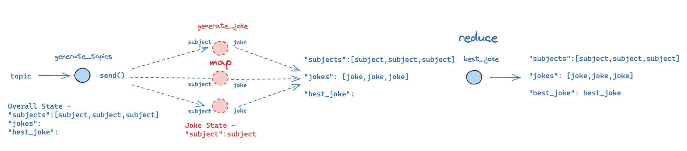
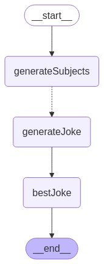

# LangGraphJS > How-to Guides > How to create map-reduce branches for parallel execution

This project is based on the [How to create map-reduce branches for parallel execution](https://langchain-ai.github.io/langgraphjs/how-tos/map-reduce/)

Map-reduce operations are essential for efficient task decomposition and parallel processing. This approach involves breaking a task into smaller sub-tasks, processing each sub-task in parallel, and aggregating the results across all of the completed sub-tasks.

Consider this example: given a general topic from the user, generate a list of related subjects, generate a joke for each subject, and select the best joke from the resulting list. In this design pattern, a first node may generate a list of objects (e.g., related subjects) and we want to apply some other node (e.g., generate a joke) to all those objects (e.g., subjects). However, two main challenges arise.

(1) the number of objects (e.g., subjects) may be unknown ahead of time (meaning the number of edges may not be known) when we lay out the graph and (2) the input State to the downstream Node should be different (one for each generated object).

LangGraph addresses these challenges through its Send API. By utilizing conditional edges, Send can distribute different states (e.g., subjects) to multiple instances of a node (e.g., joke generation). Importantly, the sent state can differ from the core graph's state, allowing for flexible and dynamic workflow management.

