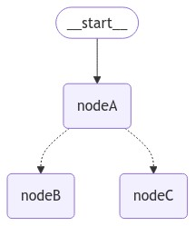

# LangGraphJS > How-to Guides > How to combine control flow and state updates with Command

This project is based on the [How to combine control flow and state updates with Command](https://langchain-ai.github.io/langgraphjs/how-tos/command/)

It can be useful to combine control flow (edges) and state updates (nodes). For example, you might want to BOTH perform state updates AND decide which node to go to next in the SAME node. LangGraph provides a way to do so by returning a Command object from node functions:

```ts
const myNode = (state: typeof StateAnnotation.State) => {
  return new Command({
    // state update
    update: {
      foo: "bar",
    },
    // control flow
    goto: "myOtherNode",
  });
};
```

If you are using subgraphs, you might want to navigate from a node a subgraph to a different subgraph (i.e. a different node in the parent graph). To do so, you can specify graph: Command.PARENT in Command:

```ts
const myNode = (state: typeof StateAnnotation.State) => {
  return new Command({
    update: { foo: "bar" },
    goto: "other_subgraph", // where `other_subgraph` is a node in the parent graph
    graph: Command.PARENT,
  });
};
```


