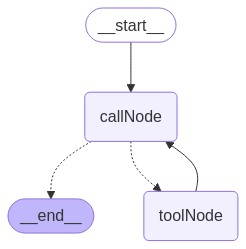

# LangGraphJS > How-to Guides > Persistence

This project is based on the [Persistence](https://langchain-ai.github.io/langgraphjs/how-tos/persistence/)

Many AI applications need memory to share context across multiple interactions in a single conversational "thread." In LangGraph, this type of conversation-level memory can be added to any graph using Checkpointers.

Just compile the graph with a compatible checkpointer. Below is an example using a simple in-memory "MemorySaver":

```ts
import { MemorySaver } from "@langchain/langgraph";

const checkpointer = new MemorySaver();
const graph = workflow.compile({ checkpointer });
```


