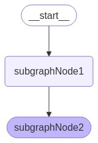
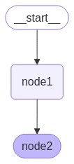

# LangGraphJS > How-to Guides > How to add thread-level persistence to subgraphs

This project is based on the [How to add thread-level persistence to subgraphs](https://langchain-ai.github.io/langgraphjs/how-tos/subgraph-persistence/)

To add persistence to a graph with subgraphs, all you need to do is pass a checkpointer when compiling the parent graph. LangGraph will automatically propagate the checkpointer to the child subgraphs.

