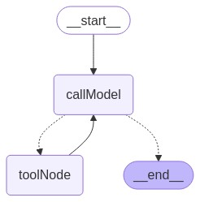

# LangGraphJS > How-to Guides > How to manage conversation history

This project is based on the [How to manage conversation history](https://langchain-ai.github.io/langgraphjs/how-tos/manage-conversation-history/)

Note: this guide focuses on how to do this in LangGraph, where you can fully customize how this is done. If you want a more off-the-shelf solution, you can look into functionality provided in LangChain:

[How to filter messages](https://js.langchain.com/docs/how_to/filter_messages/)

[How to trim messages](https://js.langchain.com/docs/how_to/trim_messages/)

