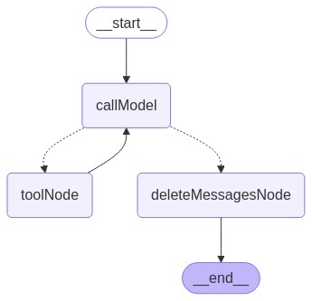
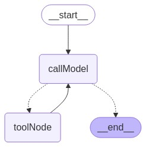

# LangGraphJS > How-to Guides > How to delete messages

This project is based on the [How to delete messages](https://langchain-ai.github.io/langgraphjs/how-tos/delete-messages/)

One of the common states for a graph is a list of messages. Usually you only add messages to that state. However, sometimes you may want to remove messages (either by directly modifying the state or as part of the graph). To do that, you can use the RemoveMessage modifier. In this guide, we will cover how to do that.

The key idea is that each state key has a reducer key. This key specifies how to combine updates to the state. The prebuilt MessagesAnnotation has a messages key, and the reducer for that key accepts these RemoveMessage modifiers. That reducer then uses these RemoveMessage to delete messages from the key.

So note that just because your graph state has a key that is a list of messages, it doesn't mean that that this RemoveMessage modifier will work. You also have to have a reducer defined that knows how to work with this.

NOTE: Many models expect certain rules around lists of messages. For example, some expect them to start with a user message, others expect all messages with tool calls to be followed by a tool message. **When deleting messages, you will want to make sure you don't violate these rules**.

