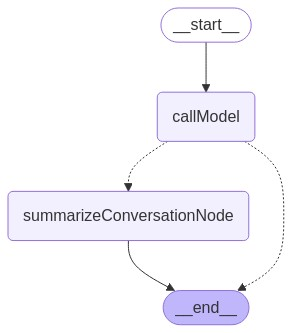

# LangGraphJS > How-to Guides > How to add summary of the conversation history

This project is based on the [How to add summary of the conversation history](https://langchain-ai.github.io/langgraphjs/how-tos/add-summary-conversation-history/)

One of the most common use cases for persistence is to use it to keep track of conversation history. This is great - it makes it easy to continue conversations. As conversations get longer and longer, however, this conversation history can build up and take up more and more of the context window. This can often be undesirable as it leads to more expensive and longer calls to the LLM, and potentially ones that error. One way to work around that is to create a summary of the conversation to date, and use that with the past N messages. This guide will go through an example of how to do that.

This will involve a few steps: - Check if the conversation is too long (can be done by checking number of messages or length of messages) - If yes, the create summary (will need a prompt for this) - Then remove all except the last N messages

