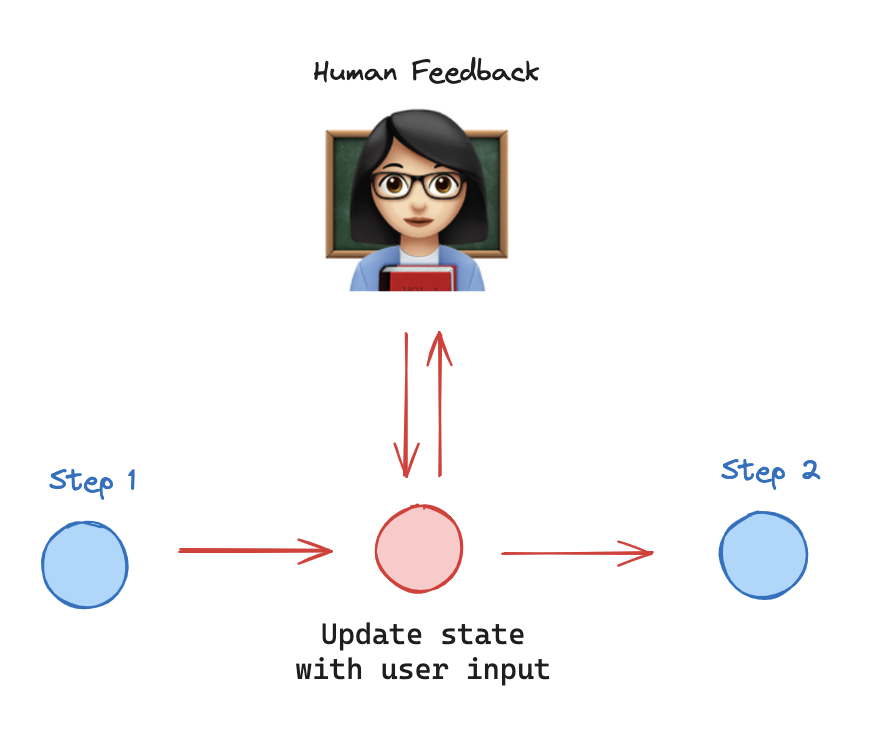
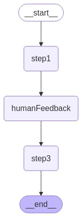
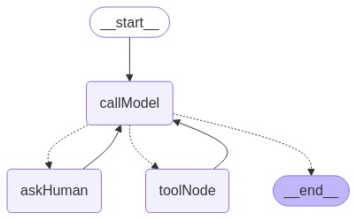

# LangGraphJS > How-to Guides > How to wait for user input

This project is based on the [How to wait for user input](https://langchain-ai.github.io/langgraphjs/how-tos/wait-user-input/)

Human-in-the-loop (HIL) interactions are crucial for agentic systems. Waiting for human input is a common HIL interaction pattern, allowing the agent to ask the user clarifying questions and await input before proceeding.

We can implement these in LangGraph using the interrupt() function. interrupt allows us to stop graph execution to collect input from a user and continue execution with collected input.

Let's explore a basic example of using human feedback. A straightforward approach is to create a node, human_feedback, designed specifically to collect user input. This allows us to gather feedback at a specific, chosen point in our graph.

## Steps:

1- Call `interrupt()` inside the `human_feedback` node.

2- We set up a checkpointer to save the state of the graph up until this node.

3- Use `new Command({ resume: ... })` to provide the requested value to the human_feedback node and resume execution.

