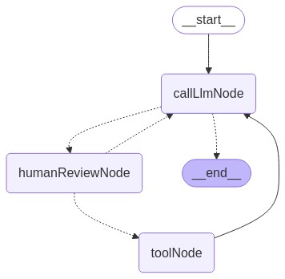

# LangGraphJS > How-to Guides > Review Tool Calls

This project is based on the [Review Tool Calls](https://langchain-ai.github.io/langgraphjs/how-tos/review-tool-calls/)

Human-in-the-loop (HIL) interactions are crucial for agentic systems. A common pattern is to add some human in the loop step after certain tool calls. These tool calls often lead to either a function call or saving of some information. Examples include:

- A tool call to execute SQL, which will then be run by the tool
- A tool call to generate a summary, which will then be saved to the State of the graph
  Note that using tool calls is common whether actually calling tools or not.

There are typically a few different interactions you may want to do here:

1. Approve the tool call and continue
2. Modify the tool call manually and then continue
3. Give natural language feedback, and then pass that back to the agent instead of continuing

We can implement these in LangGraph using the interrupt() function. interrupt allows us to stop graph execution to collect input from a user and continue execution with collected input:

```ts
function humanReviewNode(state: typeof GraphAnnotation.State) {
  // this is the value we'll be providing via new Command({ resume: <human_review> })
  const humanReview = interrupt({
    question: "Is this correct?",
    // Surface tool calls for review
    tool_call,
  });

  const [reviewAction, reviewData] = humanReview;

  // Approve the tool call and continue
  if (reviewAction === "continue") {
    return new Command({ goto: "run_tool" });
  }

  // Modify the tool call manually and then continue
  if (reviewAction === "update") {
    const updatedMsg = getUpdatedMsg(reviewData);
    return new Command({
      goto: "run_tool",
      update: { messages: [updatedMsg] },
    });
  }

  // Give natural language feedback, and then pass that back to the agent
  if (reviewAction === "feedback") {
    const feedbackMsg = getFeedbackMsg(reviewData);
    return new Command({
      goto: "call_llm",
      update: { messages: [feedbackMsg] },
    });
  }

  throw new Error("Unreachable");
}
```


