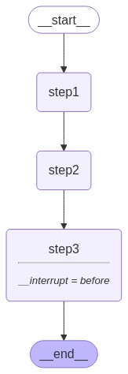
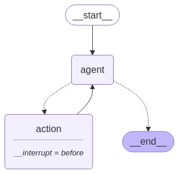

# LangGraphJS > How-to Guides > How to add breakpoints

This project is based on the [How to add breakpoints](https://langchain-ai.github.io/langgraphjs/how-tos/breakpoints/)

Human-in-the-loop (HIL) interactions are crucial for agentic systems. Breakpoints are a common HIL interaction pattern, allowing the graph to stop at specific steps and seek human approval before proceeding (e.g., for sensitive actions).

Breakpoints are built on top of LangGraph checkpoints, which save the graph's state after each node execution. Checkpoints are saved in threads that preserve graph state and can be accessed after a graph has finished execution. This allows for graph execution to pause at specific points, await human approval, and then resume execution from the last checkpoint.

