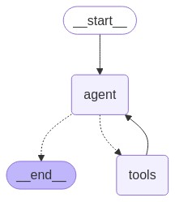
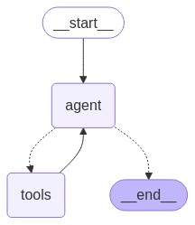
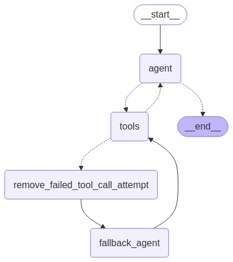

# LangGraphJS > How-to Guides > How to force an agent to call a tool

This project is based on the [How to force an agent to call a tool](https://langchain-ai.github.io/langgraphjs/how-tos/tool-calling-errors/)

In this example we will build a ReAct agent that always calls a certain tool first, before making any plans. In this example, we will create an agent with a search tool. However, at the start we will force the agent to call the search tool (and then let it do whatever it wants after). This is useful when you know you want to execute specific actions in your application but also want the flexibility of letting the LLM follow up on the user's query after going through that fixed sequence.

## Basic Example

## Custom Strategies Example

## Fallback Agent Example

