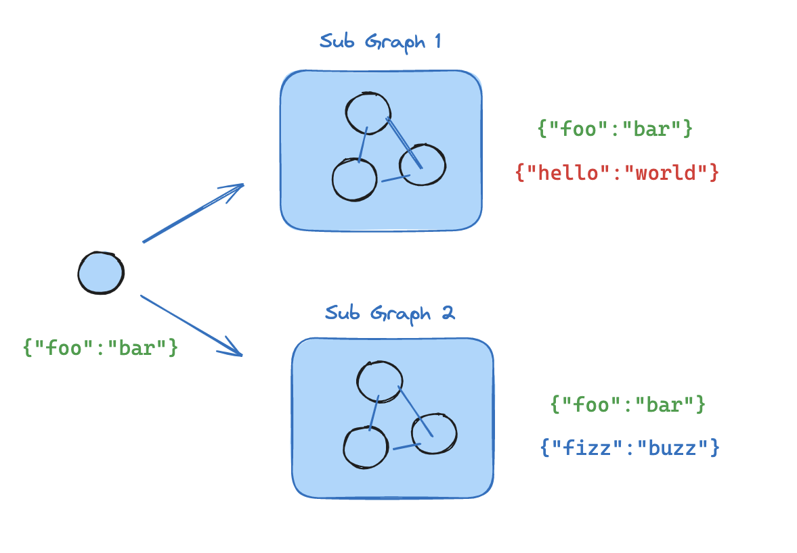

# LangGraphJS > How-to Guides > How to add and use subgraphs

This project is based on the [How to add and use subgraphs](https://langchain-ai.github.io/langgraphjs/how-tos/subgraph/)

`Subgraphs` allow you to build complex systems with multiple components that are themselves graphs. A common use case for using subgraphs is building `multi-agent systems`.

The main question when adding subgraphs is how the parent graph and subgraph communicate, i.e. how they pass the `state` between each other during the graph execution. There are two scenarios:

- parent graph and subgraph share schema keys. In this case, you can `add a node with the compiled subgraph`
- parent graph and subgraph have different schemas. In this case, you have to `add a node function that invokes the subgraph`: this is useful when the parent graph and the subgraph have different state schemas and you need to transform state before or after calling the subgraph

Below we show to to add subgraphs for each scenario.

