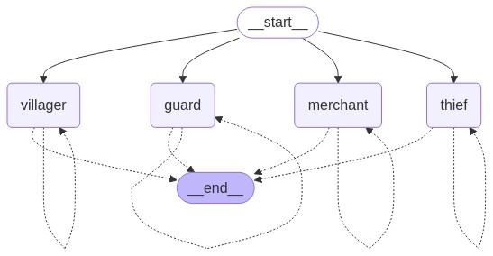

# LangGraphJS > How-to Guides > How to build a multi-agent network

This project is based on the [How to build a multi-agent network](https://langchain-ai.github.io/langgraphjs/how-tos/multi-agent-network/)

In this how-to guide we will demonstrate how to implement a multi-agent network architecture.

Each agent can be represented as a node in the graph that executes agent step(s) and decides what to do next - finish execution or route to another agent (including routing to itself, e.g. running in a loop). A common pattern for routing in multi-agent architectures is handoffs. Handoffs allow you to specify:

1- which agent to navigate to next and (e.g. name of the node to go to)

2- what information to pass to that agent (e.g. state update)

To implement handoffs, agent nodes can return Command object that allows you to combine both control flow and state updates:

```ts
const agent = async (state) => {
  // the condition for routing/halting can be anything
  // e.g. LLM tool call / structured output, etc.
  const goto = getNextAgent(...); // "agent" / "another_agent"
  if (goto) {
    return new Command({
      goto,
      update: {
        myStateKey: "my_state_value",
      }
    });
  }
  ...
}
```


