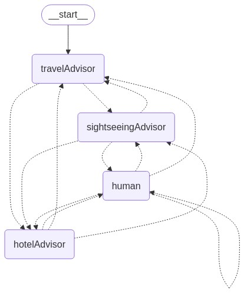

# LangGraphJS > How-to Guides > How to add multi-turn conversation in a multi-agent application

This project is based on the [How to add multi-turn conversation in a multi-agent application](https://langchain-ai.github.io/langgraphjs/how-tos/multi-agent-multi-turn-convo/)

In this how-to guide, we’ll build an application that allows an end-user to engage in a multi-turn conversation with one or more agents. We'll create a node that uses an interrupt to collect user input and routes back to the active agent.

The agents will be implemented as nodes in a graph that executes agent steps and determines the next action:

Wait for user input to continue the conversation, or
Route to another agent (or back to itself, such as in a loop) via a handoff.

```ts
function human(state: typeof MessagesAnnotation.State): Command {
  const userInput: string = interrupt("Ready for user input.");

  const activeAgent = ...;

  return new Command({
    update: {
      messages: [{
        role: "human",
        content: userInput,
      }]
    },
    goto: activeAgent,
  });
}

function agent(state: typeof MessagesAnnotation.State): Command {
  const goto = getNextAgent(...);

  if (goto) {
    return new Command({
      goto,
      update: { myStateKey: "myStateValue" }
    });
  } else {
    return new Command({
      goto: "human"
    });
  }
}
```



# Travel Recommendations Example

In this example, we will build a team of travel assistant agents that can communicate with each other via handoffs.

We will create 3 agents:

- `travelAdvisor`: can help with general travel destination recommendations. Can ask sightseeingAdvisor and hotelAdvisor for help.
- `sightseeingAdvisor`: can help with sightseeing recommendations. Can ask travelAdvisor and hotelAdvisor for help.
- `hotelAdvisor`: can help with hotel recommendations. Can ask sightseeingAdvisor and hotelAdvisor for help.
